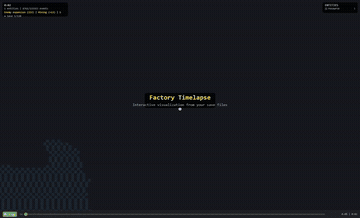

# Factorio Plugins

A collection of plugins and tools for [Factorio](https://factorio.com/).

## Factory Timelapse

Interactive timelapse visualization of your factory's growth — either from live play or by batch-processing existing save files.



*[Watch full showcase video](showcase.mp4)*

The system has three components:

### 1. Factorio Mod (`factory-timelapse-mod/`)

A Factorio 2.0 mod that captures entity data in two modes:

- **Live mode** — Listens to all build/remove events during gameplay with zero startup delay and near-zero performance impact. No baseline scan on load — the starting state is read from your save file offline during timelapse generation. Outputs to `script-output/factory-timelapse/`:
  - `events.jsonl` — each build/remove with player name, product, belt type (~150 bytes/event). Also captures space platform state changes (departure, arrival, deletion).
  - `player_positions.jsonl` — all players every 5 seconds with position, surface, and color (~120 bytes/player/5s)
  - Periodic space platform snapshots (state, location, speed, entity count) every 5 seconds
  - Typical 8-hour session: ~1.5MB total. No measurable UPS impact.
- **Scan mode** — Run `/timelapse-scan` in-game (or use the batch scanner) to dump all entities on the current surface as a JSON snapshot with real game ticks, player positions, water tiles, resource patches, production recipes, rail connections, and belt connections.

**Multiplayer:** The mod must be installed on the server (all clients sync automatically). All players are tracked — each build event records who built it, and player positions include per-player colors for distinct visualization.

**Space Age:** Full support for multi-planet gameplay:
- Automatically scans other surfaces (Vulcanus, Fulgora, Gleba, Aquilo) that have player-built entities
- **Space platform tracking:** captures platform name, state (traveling/waiting/departed), current location, speed, schedule (destination list), and entity count
- Platform lifecycle events: state changes, departures, arrivals, deletions
- Platform entities scanned as separate surface files
- All wrapped in `pcall` — works safely on non-Space Age games

#### Installation

Copy or symlink `factory-timelapse-mod` into your Factorio mods directory as `factory-timelapse_0.2.0`:

```bash
# Standalone install
cp -r factory-timelapse-mod /path/to/factorio/mods/factory-timelapse_0.2.0

# Steam (Windows)
cp -r factory-timelapse-mod "%APPDATA%/Factorio/mods/factory-timelapse_0.2.0"
```

#### Mod Settings

| Setting | Default | Description |
|---------|---------|-------------|
| `factory-timelapse-surface` | `nauvis` | Which surface to capture |
| `factory-timelapse-mode` | `live` | `live` (events + player tracking) or `scan-only` |
| `factory-timelapse-autoscan` | `false` | Auto-scan on load (used by batch scanner) |

### 2. Data Tools (`timelapse-renderer/`)

Python tools for scanning saves and preprocessing data for the viewer.

#### Requirements

- Python 3.10+ (3.12 recommended)
- Pillow (for sprite atlas generation)

```bash
cd timelapse-renderer
pip install -r requirements.txt
```

#### Batch-scan existing saves

Scan save files automatically using Factorio's headless benchmark mode:

```bash
python scan_saves.py \
  --saves /path/to/saves/ \
  --output ./scan_output \
  --factorio /path/to/factorio.exe \
  --mod-dir /path/to/factorio/mods \
  --workers 4    # parallel Factorio instances (uses directory junctions, no file copying)
  --first 5      # optional: only process first N saves for testing
  --skip-done    # skip saves that already have output (resume interrupted scans)
  --timeout 1200 # timeout per save in seconds (default: 900)
```

Each save is loaded headless via `--benchmark`, scanned in one tick, and the JSON output is collected. Use `--workers` to run multiple Factorio instances in parallel (each gets an isolated write directory via directory junction). Works with modded saves — all mods are shared. Water tiles are only kept every 10th save (static terrain). Logs elapsed time per save.

#### Preprocess for web viewer

```bash
python preprocess.py \
  --input ./scan_output \
  --output ./scan_output/viewer_data.json \
  --factorio-data /path/to/factorio/data   # optional: generates sprite atlas for product icons
```

For live mode, provide the save file you were playing as baseline:

```bash
python preprocess.py \
  --input /path/to/script-output/factory-timelapse \
  --baseline-save /path/to/saves/my-save.zip \
  --factorio /path/to/factorio.exe \
  --output viewer_data.json
```

Preprocesses all scan data into a single optimized file:
- Diffs consecutive snapshots to find added/removed entities
- Detects **upgrades** (same position, same category) and emits instant swaps
- **Precomputes belt/pipe connections** from position + direction data — viewer draws directly from stored connections, zero per-frame computation
- **Back-fills missing products** from later snapshots (e.g. furnaces built before recipe was set)
- **Filters transient entities** (trains, vehicles, items on ground) from static scan visualization
- **Smart icon search** for sprite atlas: name mappings, prefix stripping, subdirectory search
- Generates **activity descriptions** ("Clearing enemies", "Expanding mining", etc.)
- Builds **world state checkpoints** every 2% for instant seeking
- Creates **sprite atlas** PNG with all product icons (single HTTP request)
- Enemies and resources appear instantly (discovered, not built)

### 3. Interactive Viewer (`timelapse-viewer/`)

A browser-based interactive viewer for exploring the timelapse data. No build step — pure vanilla HTML/JS/Canvas2D.

#### Preprocessing (recommended)

For best performance, preprocess the scan data into a single optimized file:

```bash
cd timelapse-renderer
python preprocess.py \
  --input ./scan_output \
  --output ./scan_output/viewer_data.json \
  --factorio-data /path/to/factorio/data   # generates sprite atlas for product icons
```

This moves all heavy computation (diffing, ordering, checkpoints, upgrade detection) offline. The webapp loads one file and renders — near-instant startup.

#### Running the viewer

```bash
cd timelapse-viewer
python serve.py --input ../timelapse-renderer/scan_output --factorio-data /path/to/factorio/data
# Open http://localhost:8090
```

Falls back to raw scan files if no preprocessed data is found (slower loading).

#### Features

- **Pan** (click drag) and **zoom** (scroll wheel) the factory map
- **Timeline scrubber** with smooth interpolation between snapshots (same build-order animation as the video)
- **Play/pause** with adjustable speed
- **Overlay toggles** — player marker, player trail, water, product icons, resource labels (all checkboxes)
- **Category toggles** — checkbox per entity type to show/hide (belts, enemies, resources, etc.)
- **Hover tooltips** — entity name, product being made, position
- **Product icons** — actual Factorio item icons overlaid on buildings (requires `--factorio-data`)
- **Player position** marker (white = real from save, yellow = inferred from build order) with optional trail
- **Specialized entity rendering:**
  - Belts: directional strips with precomputed flow connections, color per tier (yellow/red/blue/green)
  - Underground belts: entrance (stub + hole) vs exit (hole + stub) with direction
  - Splitters: dual parallel strips with cross bar
  - Inserters: arm + grabber dot, color per tier (yellow/red/blue/green)
  - Pipes: thin connected lines with junction dots (precomputed connections)
  - Rails: connected rail graph (precomputed adjacency)
  - Electric poles: clean dots (bigger for big poles/substations)
  - Turrets: square base + directional barrel
  - Labs: hexagonal shape with flask symbol
  - Storage tanks: circular with inner ring
  - Miners: U-shaped body with product icon inside
  - Chests: rounded rectangles with lid line, color-coded per type
  - Lamps: glowing circles with warm light halo
- **Level of detail** — zoomed-out view uses fast simple rectangles, zoomed-in shows detailed shapes
- **Render throttling** — mouse/zoom events coalesced via requestAnimationFrame for smooth interaction
- **Upgrade detection** — belt/inserter/assembler/furnace/drill upgrades show as instant color swaps (not remove + rebuild)
- **Sprite atlas** — all product icons in one PNG (preprocessed), single HTTP request
- **Data source indicator** — shows whether current view is at a real save snapshot (green `●`) or interpolating between saves (orange `○` with percentage)
- **Natural build ordering** — entities clustered by proximity, clusters ordered by walking path, belts/pipes/rails/power poles/walls traced as chains
- **Water tiles** rendered as background
- **Activity text** and **game clock** overlay
- **Keyboard shortcuts:**

| Key | Action |
|-----|--------|
| `Space` | Play / pause |
| `←` / `→` | Step backward / forward |
| `↑` / `↓` | Faster / slower |
| `F` | Fit camera to factory |
| `Home` / `End` | Jump to start / end |

#### Entity color coding

| Category | Color | Examples |
|----------|-------|---------|
| Belt (basic) | Yellow | Transport belts, splitters, underground belts |
| Belt (fast) | Red | Fast transport belts, fast splitters |
| Belt (express) | Blue | Express transport belts |
| Belt (turbo) | Green | Turbo transport belts |
| Inserter (burner) | Brown | Burner inserter |
| Inserter (basic) | Yellow | Inserter — arm + grabber dot |
| Inserter (long) | Red | Long-handed inserter — longer arm |
| Inserter (fast) | Blue | Fast inserter |
| Inserter (bulk/stack) | Green | Bulk/stack inserter |
| Assembler 1 | Gray | Assembling machine 1 |
| Assembler 2 | Light blue | Assembling machine 2 |
| Assembler 3 | Bright blue | Assembling machine 3 |
| Furnace (stone/steel/elec) | Dark→bright orange | Furnaces (3 tiers) |
| Power | Red | Boilers, steam engines, solar panels |
| Poles | Red dots | Electric poles (size varies), substations |
| Mining (burner/elec/big) | Dark→bright brown | U-shaped drills with product icon |
| Pipe | Teal | Connected thin lines with junction dots |
| Logistics | Purple | Roboports, logistic chests |
| Rail | Gray | Connected rail graph |
| Turret | Dark gray | Square base + directional barrel |
| Wall | Dark gray | Walls, gates |
| Enemy | Dark red | Biters, spawners, worm turrets |
| Lab | Blue-gray hexagon | Labs — hexagonal with flask symbol |
| Storage tank | Round | Circular with inner ring |
| Resource | Subtle/dark | Iron ore, copper ore, coal, stone, uranium, oil |

## License

MIT
